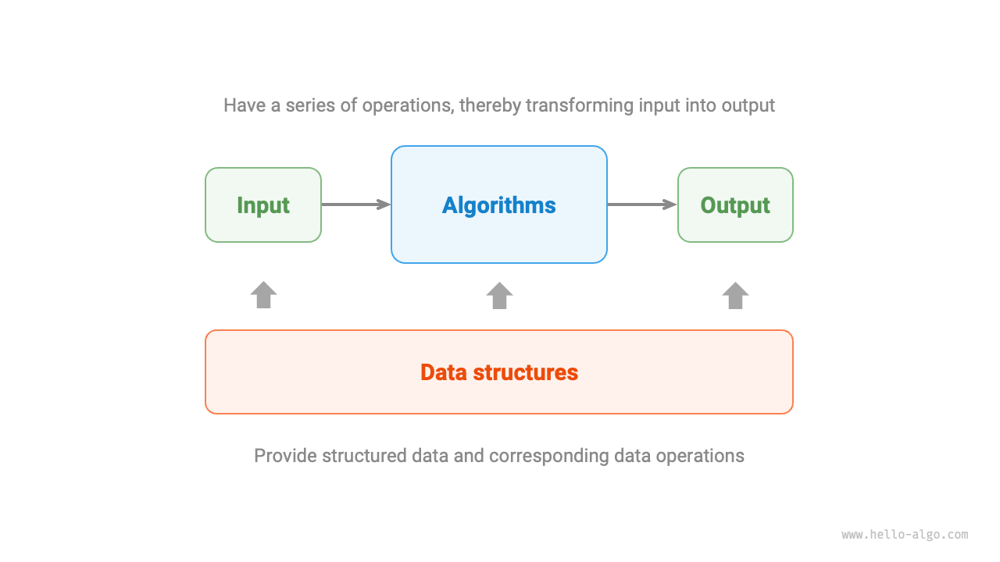

# Chương 1. Tổng quan về thuật toán

## 1. Thuật toán là gì?

### 1.1 Định nghĩa về thuật toán

> An algorithm is a set of instructions or steps to solve a specific problem within a finite amount of time
> _Thuật toán là một tập hợp các hướng dẫn hoặc các bước để giải quyết một vấn đề cụ thể nào đó trong một khoảng thời gian hữu hạn_

Các đặc điểm của thuật toán:

- Vấn đề được xác định rõ ràng, bao gồm cả định nghĩa rõ ràng về đầu vào (input) và đầu ra (output)
- Thuật toán khả thi, nghĩa là nó có thể được hoàn thành trong một số bước, thời gian và không gian bộ nhớ hữu hạn
- Mỗi bước đều có một ý nghĩa xác định, đầu ra luôn luôn giống nhau trong cùng điều kiện và đầu vào

### 1.2 Định nghĩa về cấu trúc dữ liệu

> Cấu trúc dữ liệu là cách tổ chức và lưu trữ dữ liệu trong máy tính

Cấu trúc dữ liệu phải đảm bảo các mục đích thiết kế sau:

- Giảm thiểu chiếm dụng không gian để tiết kiệm bộ nhớ máy tính
- Thực hiện các thao tác dữ liệu nhanh nhất có thể, bao gồm truy cập, thêm, xoá, cập nhật dữ liệu,...
- Cung cấp cách trình bày dữ liệu ngắn gọn và thông tin logic để cho phép thực hiện thuật toán hiệu quả

### 1.3 Mối quan hệ giữa thuật toán và cấu trúc dữ liệu

Cấu trúc dữ liệu và thuật toán có mối liên quan chặt chẽ với nhau:

- Cấu trúc dữ liệu là nền tảng của thuật toán, cung cấp khả năng lưu trữ dữ liệu có cấu trúc và các phương pháp thao tác dữ liệu cho các thuật toán
- Thuật toán là giai đoạn mà cấu trúc dữ liệu phát huy tác dụng, riêng cấu trúc dữ liệu chỉ lưu trữ thông tin dữ liệu, thông qua việc áp dụng các thuật toán mà các vấn đề cụ thể có thể được giải quyết
- Các thuật toán thường có thể được triển khai dựa trên các cấu trúc dữ liệu khác nhau, nhưng hiệu quả thực thi của chúng có thể khác nhau rất nhiều, chọn cấu trúc dữ liệu phù hợp là chìa khoá
  

## 2. Ví dụ về thuật toán
